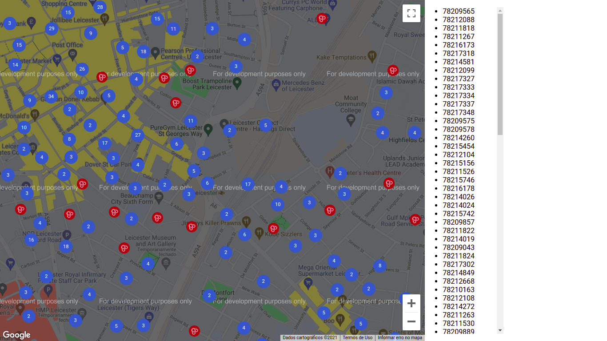

# React Google Maps Clustered

</img>
</img>

##### Este repositório contém um projeto de exemplo de como implementar um mapa do google maps. Para executar siga as instruções a seguir...

1. Primeiro você precisa estar com o Node.js instalado em sua máquina e de preferência, com o yarn instalado também
2. Para que este projeto funcione você precisa ir até o arquivo `.env.example` e renomear para `.env`
3. A seguir, você precisa registrar uma chave de api do google ou utilizar uma já registrada. Esta chave deve possuir o serviço do google maps ativado.
4. Cole a chave dentro do arquivo `.env` como valor para `REACT_APP_GOOGLE_KEY`
5. Agora você pode instalar as dependências deste projeto com o comando...
   `yarn install`
6. Com todas as dependências instaladas, você já pode executar o modo de desenvolvimento do projeto com o comando...
   `yarn start`

##### Gerar uma versão de produção:

Parar gerar um código mimificado que é destinado a produção você só precisa rodar o seguinte comando
`yarn build`
Será gerada uma pasta `./build` contendo o projeto compilado.
